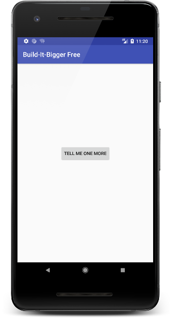
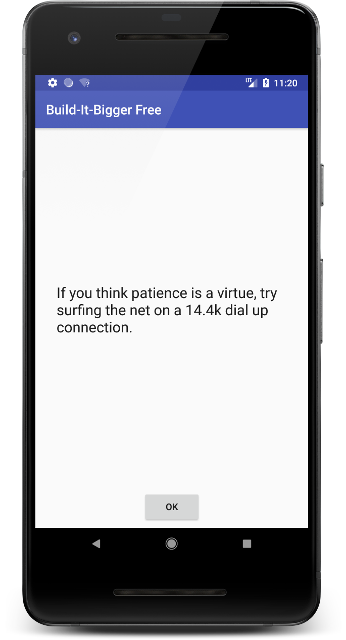

#### (Udacity Android Developer Nanodegree Project 4)
# Build It Bigger: Android App for Joke-Telling
### Used Gradle to build a joke-telling app that has both a free and paid version. This included factoring functionality into libraries as well as using build flavors to modularize the construction of each variant of the app. I also configured a Google Cloud Endpoints development server to supply the jokes.
---

* Technologies: Java, XML, Gradle, Google Cloud Endpoints
* Platform Features: Free and Paid Versions, Build Flavours, Java and Android Libraries, AsyncTask
* Libraries: Admob, Google API
* Tools and OS : Android Studio, Ubuntu
* Platform: Android 4.1+
* Modules: Java Library, Android Library, Backend
* Lines of Code:  505
* Duration: 1 Week (FEB 2018)

### Screenshots

